# mpcrseq exploratory

Import data and join amplicon size data with genotyping data.


```r
library(tidyverse)
library(lme4)

vcf	               <- read_csv("vcf_129snp_long.csv")
```

```
## Parsed with column specification:
## cols(
##   CHROM = col_double(),
##   POS = col_double(),
##   REF = col_character(),
##   ALT = col_character(),
##   SAMPLE_NAME_IN_RUN = col_character(),
##   GT = col_character(),
##   PL = col_character(),
##   DP = col_double(),
##   AD = col_character(),
##   GQ = col_double()
## )
```

```r
s1s2_product_sizes <- read_tsv("set12_product_sizes.tsv")
```

```
## Parsed with column specification:
## cols(
##   snp_id = col_character(),
##   template_size = col_double(),
##   pcr1_product = col_double(),
##   pcr2_product = col_double()
## )
```

```r
s1s2$snp_id <- gsub('-500','', s1s2$snp_id)

vcf$snp_id <- paste(vcf$CHROM, vcf$POS, sep = ":")

vcf <- left_join(s1s2, vcf)
```

```
## Joining, by = "snp_id"
```

```r
vcf <- vcf %>% filter(!is.na(CHROM))

vcf$sample <- vcf$SAMPLE_NAME_IN_RUN

metadata <- read_csv('big_bam_list.csv')
```

```
## Parsed with column specification:
## cols(
##   sample = col_character(),
##   run_id = col_character(),
##   sample_id = col_character(),
##   species = col_character(),
##   type = col_character(),
##   dna = col_double(),
##   Year = col_character(),
##   region = col_character()
## )
```

```r
vcf <- left_join(vcf, metadata)
```

```
## Joining, by = "sample"
```

```r
pchar <- read_tsv('pchar.tsv')
```

```
## Parsed with column specification:
## cols(
##   chrom = col_double(),
##   start = col_double(),
##   stop = col_double(),
##   amplicon_snp_position = col_double(),
##   l_start = col_double(),
##   r_start = col_double(),
##   l_length = col_double(),
##   r_length = col_double(),
##   amplicon_size = col_double(),
##   f_seq = col_character(),
##   r_seq = col_character(),
##   amplicon = col_character(),
##   template = col_character(),
##   f_gc_clamp = col_logical(),
##   r_gc_clamp = col_logical(),
##   f_gc_3prime = col_logical(),
##   r_gc_3prime = col_logical()
## )
```

```r
pchar$start <- as.integer(pchar$start)
pchar$name <- paste(pchar$chrom, pchar$start, sep = ':')
pchar <- pchar %>% select(snp_id = name, f_gc_clamp, r_gc_clamp, f_gc_3prime, r_gc_3prime, f_seq, r_seq) %>% distinct()
pchar <- pchar %>% mutate(gc_clamp = f_gc_clamp & r_gc_clamp, gc_3prime = f_gc_3prime, r_gc_3prime)
vcf <- left_join(vcf, pchar)
```

```
## Joining, by = "snp_id"
```


Generate some variables, and group data by snp_id.


```r
# Separate allele depth & genotype likelihoods

vcf <- vcf %>% separate(GT, c("GT1", "GT2"), "/", convert = TRUE, remove = FALSE) %>%
  separate(AD, c("AD1", "AD2"), ",", convert = TRUE, remove = FALSE) %>%
	separate(PL, c("pl00", "pl01", "pl11"), convert = TRUE, remove = FALSE) %>%
	rowwise() %>% mutate(gt = sum(GT1, GT2))
```

```
## Warning: Expected 2 pieces. Missing pieces filled with `NA` in 600 rows [3901, 3902, 3903, 3904, 3905, 3906, 3907, 3908, 3909, 3910, 3911, 3912, 3913, 3914, 3915, 3916, 3917, 3918, 3919, 3920, ...].
```

```
## Warning: Expected 3 pieces. Missing pieces filled with `NA` in 600 rows [3901, 3902, 3903, 3904, 3905, 3906, 3907, 3908, 3909, 3910, 3911, 3912, 3913, 3914, 3915, 3916, 3917, 3918, 3919, 3920, ...].
```

```r
# Calc. likelihood ratio
likelihood_ratio <- function(x) {
  y <- 10^(-x/10)
  max(y) / (sum(y) - max(y))
}

vcf <- vcf %>% rowwise() %>% mutate(lr = likelihood_ratio(c(pl00,pl01,pl11)))

vcf$called <- vcf$GQ > 20
# Group by snp_id, calc snp-level variables.

snp_data <- vcf %>% 
  group_by(snp_id, CHROM, REF, ALT, template_size, pcr1_product, pcr2_product, gc_clamp, gc_3prime, f_gc_clamp, r_gc_clamp, f_gc_3prime, r_gc_3prime) %>% 
  summarize(n_called = sum(called), n = n(), call_rate = n_called/n, AD1 = sum(AD1),
	          AD2 = sum(AD2), totalDP = sum(DP), meanDP = mean(DP), medianDP = median(DP),
						paa = sum(gt == 0) / n(), pAa = sum(gt == 1) / n(), pAA = sum(gt == 2) / n())
```

```
## Warning: Grouping rowwise data frame strips rowwise nature
```

```r
# Minor allele frequency

getmaf <- function(ad1, ad2) {
  if(ad1 == 0 || is.na(ad1) || ad2 == 0 || is.na(ad2)) {return(0)}

  af1 <- ad1 / (ad1 + ad2)
  if(af1 > 0.5){
    return(1 - af1)
  } else {
    return(af1)
  }
}

snp_data <- snp_data %>% rowwise() %>% mutate(maf = getmaf(AD1, AD2))

# Allele frequency
getaf <- function(ad1, ad2) {

  if(ad2 == 0 || is.na(ad2)) {return(0)}
	if(ad1 == 0 || is.na(ad1)) {return(1)}

  af1 <- ad1 / (ad1 + ad2)
}

snp_data <- snp_data %>% rowwise() %>% mutate(af = getaf(AD1, AD2))


sample_data <- vcf %>% group_by(sample, type, dna, Year, region, run_id) %>% summarise(n_called = sum(called), n = n(), call_rate = n_called/n, AD1 = sum(AD1),
	          AD2 = sum(AD2), totalDP = sum(DP), meanDP = mean(DP), medianDP = median(DP))
```

```
## Warning: Grouping rowwise data frame strips rowwise nature
```

```r
sample_data <- sample_data %>% group_by(run_id) %>% mutate(totalRunDP = sum(totalDP)) %>% mutate(scaledDP = totalDP / totalRunDP)
```

## Figure 1. SNP Depth


```r
vcf$SNPID <- factor(vcf$snp_id, levels = snp_data$snp_id[order(snp_data$meanDP)])
ggplot(vcf, aes(x = SNPID, y = DP)) + geom_point() + xlab("SNP ID") + ylab("Depth") + theme(axis.text.x = element_text(angle = 90, hjust = 1))
```

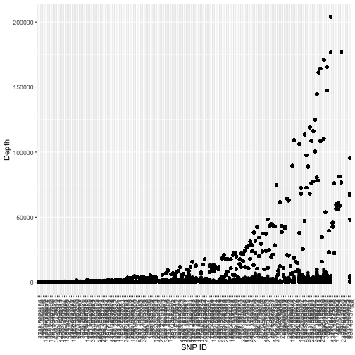

## Figure 2. SNP Mean Depth


```r
snp_data$SNPID <- factor(snp_data$snp_id, levels = snp_data$snp_id[order(snp_data$meanDP)])
ggplot(snp_data, aes(x = SNPID, y = meanDP)) + geom_point() + xlab("SNP ID") + ylab("Mean Depth") + theme(axis.text.x = element_text(angle = 90, hjust = 1))
```

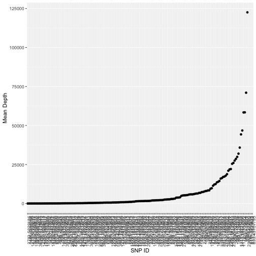

## Figure 3. Minor allele frequency histogram


```r
ggplot(snp_data, aes(x = maf)) + geom_histogram(bins = 20)
```

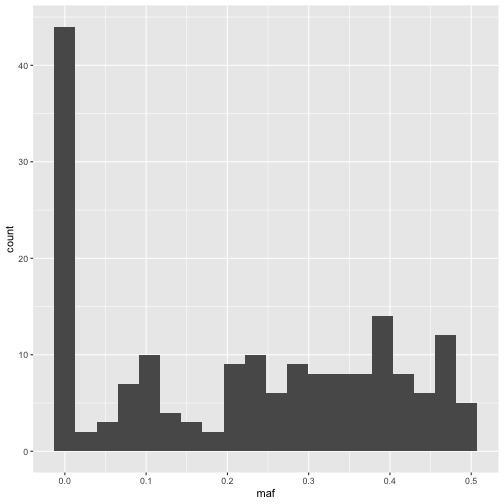

## Figure 4. Genotype frequencies


```r
p <- seq(0,1,length.out = nrow(snp_data))
q <- 1-p
pq = (1-(p^2)-(q^2))/2

aa = p^2
AA = q^2
Aa = 2*pq

cbPalette <- c("#999999", "#E69F00", "#56B4E9", "#009E73", "#F0E442", "#0072B2", "#D55E00", "#CC79A7")

ggplot(snp_data, aes(x = af)) + 
  geom_point(aes(y = paa), color = cbPalette[1]) + 
	geom_line(aes(x = p, y = aa), color = cbPalette[1]) +
	geom_point(aes(y = pAa), color = cbPalette[2]) + 
	geom_line(aes(x = p, y = Aa), color = cbPalette[2]) +
	geom_point(aes(y = pAA), color = cbPalette[3]) + 
	geom_line(aes(x = p, y = AA), color = cbPalette[3]) +
	xlab("Allele a frequency") + ylab("Genotype frequency")
```

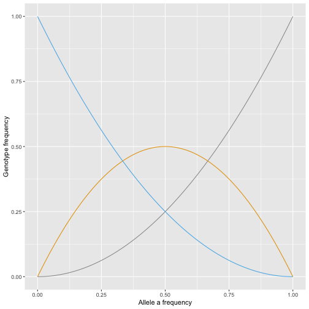

## Figure 5. Call rate x heterozygosity rate


```r
ggplot(snp_data, aes(x = pAa, y = call_rate)) + geom_point()
```

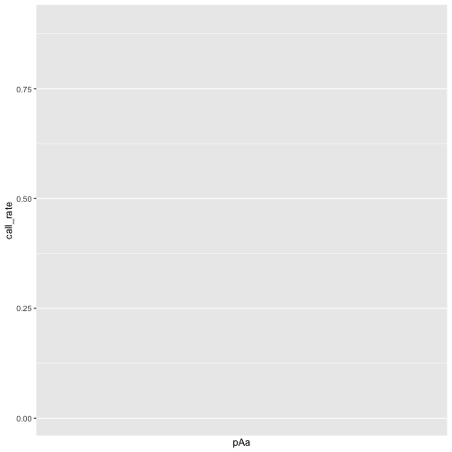

```r
ggplot(snp_data, aes(x = maf, y = call_rate)) + geom_point()
```

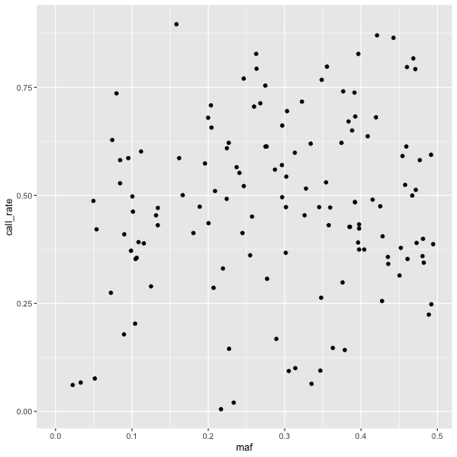

## Figure 6. Call rate x pcr product size


```r
ggplot(snp_data, aes(x = pcr1_product, y = call_rate)) + geom_point() + geom_smooth(method = "lm") + xlab("PCR 1 product size") + ylab("Call rate")
```

```
## `geom_smooth()` using formula 'y ~ x'
```

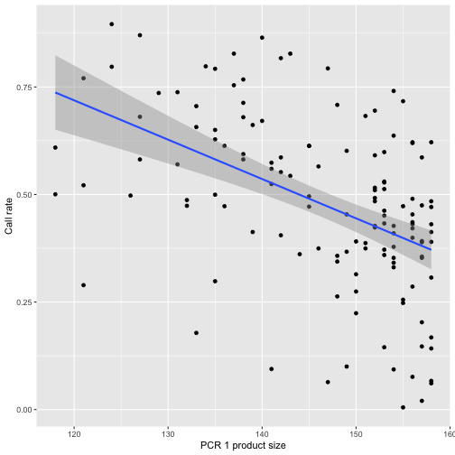


## Figure 7. PCR product size x Mean depth


```r
ggplot(snp_data, aes(x = pcr1_product, y = meanDP)) + geom_point() + ylab("Mean depth") + xlab("PCR 1 product size")
```

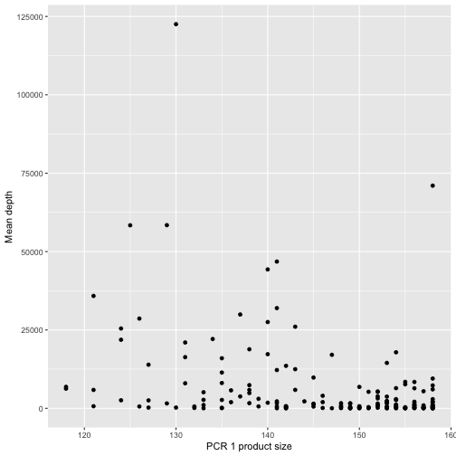


## Figure 8. Mean depth x Call rate


```r
ggplot(snp_data, aes(x = meanDP, y = call_rate)) + geom_point() + xlab("Mean depth") + ylab("Call rate")
```


## Figure 9. Sample type x Call rate


```r
ggplot(sample_data, aes(x = type, y = call_rate)) + geom_boxplot()
```

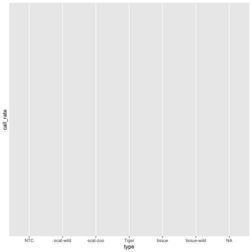


## Figure 10 a,b,c. GC Clamp x Call rate

GC clamp = TRUE if 2 or fewer GC bases in 3 prime end.


>    Returns True if fewer than 2 G or C nucleotides are within the last 5 bases.
>    Oligonucleotides with more than three G or C nucleotides within the last  five bases were  filtered.  This should help minimize mispriming at GC-rich binding sites
>    http://www.bio.net/mm/methods/2000-August/084438.html


```r
ggplot(snp_data, aes(x = gc_clamp, y = call_rate)) + geom_boxplot() + ggtitle("GC Clamp")
```

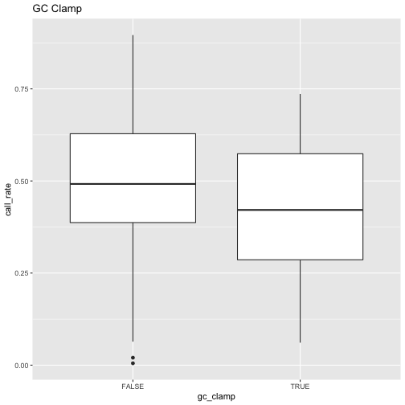

```r
ggplot(snp_data, aes(x = f_gc_clamp, y = call_rate)) + geom_boxplot() + ggtitle("Forward GC Clamp")
```

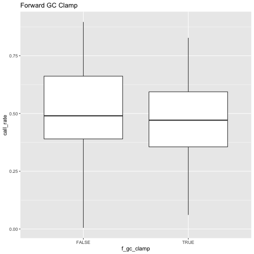

```r
ggplot(snp_data, aes(x = r_gc_clamp, y = call_rate)) + geom_boxplot() + ggtitle("Reverse GC Clamp")
```

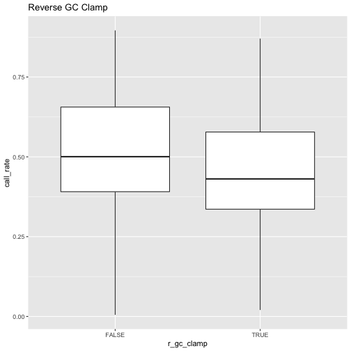


## Figure 11 a,b,c. GC 3prime x Call rate

TRUE if GC is last base at 3prime end.

>    Rationale:
>    For primers, a single G or C nucleotide at the 3'-end helps to stabilize
>    binding near the site of extension, which can reduce the possibility of
>    "breathing" and improves priming efficiency.  terefore, primers ending
>    in an A or a T base could optionally be  altered. In this study, the 
>    filter was applied. [Francis et al. 2017 - ThermoAlign: a genome-aware
>    primer design tool for tiled amplicon resequencing]
>    http://www.bio.net/mm/methods/2000-August/084438.html


```r
ggplot(snp_data, aes(x = gc_3prime, y = call_rate)) + geom_boxplot() + ggtitle("GC 3prime")
```

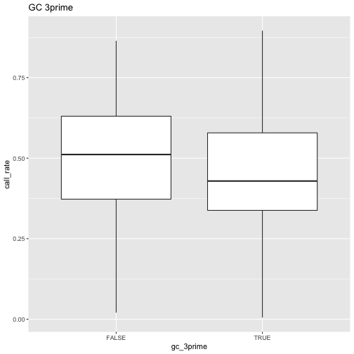

```r
ggplot(snp_data, aes(x = f_gc_3prime, y = call_rate)) + geom_boxplot() + ggtitle("Forward GC 3prime")
```

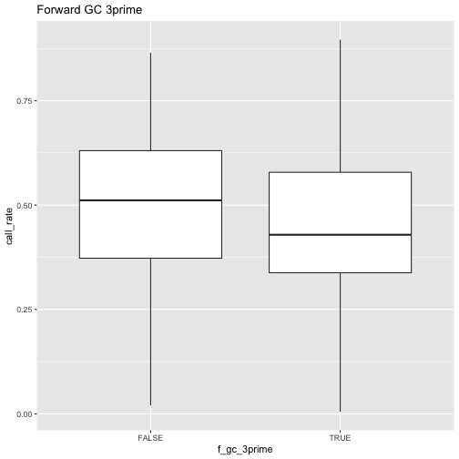

```r
ggplot(snp_data, aes(x = r_gc_3prime, y = call_rate)) + geom_boxplot() + ggtitle("Reverse GC 3prime")
```

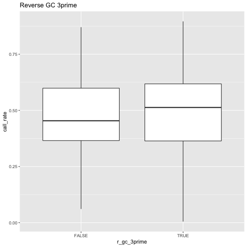


